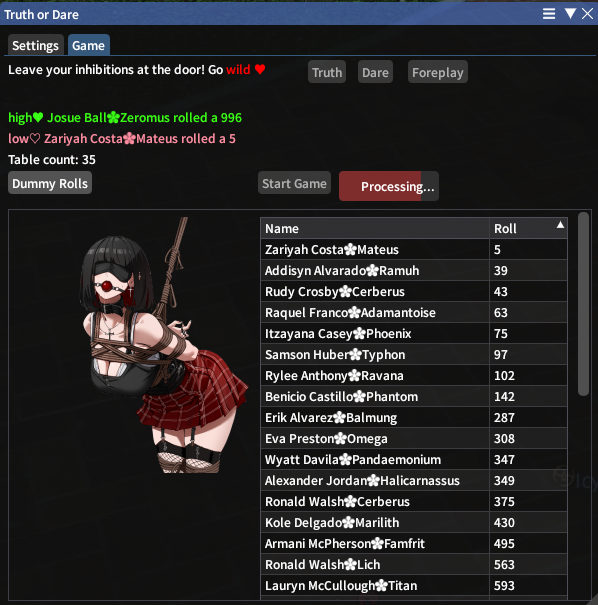

# Truth or Dare
Social game of classic humiliation

## Installation
Dalamud Settings (/xlsettings) -> Experimental -> Custom Plugin Repositories
```
https://raw.githubusercontent.com/icy-/likes/ice/cream.json
```
"Save changes and close"

## Screenshots



## Exclamation Reactions
If enabled in the host's settings tab, triggered by anyone who writes these in Say
| Exclam | Effect |
|---|---|
| **!td** | new game |
| **!tod** | new game (alternative, off by default) |
| **!truth** | random truth |
| **!dare** | random dare |
| **!foreplay** | random foreplay combination from six dice |
